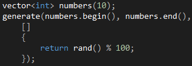
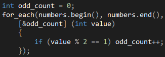

# 遇见C++ Lambda


C++中，一个lambda表达式表示一个可调用的代码单元。我们可以将其理解为一个未命名的内联函数。它与普通函数不同的是，lambda必须使用尾置返回来指定返回类型。
例如调用<algorithm>中的std::sort，ISO C++ 98 的写法是要先写一个compare函数：
```
boolcompare(int&a,int&b)
{
returna>b;//降序排序
}
```

然后，再这样调用：
```
sort(a,a+n,compare);
```
然而，用ISO C++ 11 标准新增的Lambda表达式，可以这么写：
```
sort(a,a+n,[](inta,intb){returna>b;});//降序排序
```
这样一来，代码明显简洁多了。


遇见C++ Lambda

Written by Allen Lee

 

If you die when there's no one watching, and your ratings drop and you're forgotten.

– Marilyn Manson, Lamb Of God

 

##生成随机数字  
如代码1所示。  
generate函数接受三个参数，前两个参数指定容器的起止位置，后一个参数指定生成逻辑，  
这个逻辑正是通过Lambda来表达的。  
代码1：  
  
我们现在看到Lambda是最简形式，只包含捕获子句和函数体两个必要部分，其他部分都省略了。[]是Lambda的捕获子句，也是引出Lambda的语法，当编译器看到这个符号时，就知道我们在写一个Lambda了。函数体通过{} 包围起来，里面的代码和一个普通函数的函数体没有什么不同。  
    那么，代码1生成的随机数字里有多少个奇数呢，我们可以通过for_each函数数一下，如代码3所示。和generate函数不同的是，for_each函数要求我们提供的Lambda接受一个参数。一般情况下，如果Lambda的参数列表不包含任何参数，我们可以把它省略，就像代码1所示的那样；如果包含多个参数，可以通过逗号分隔，如(int index, std::string item)。  
代码2：  
  
看到这里，细心的读者可能已经发现代码2的捕获子句里面多了一个**"&odd_count"**，这是用来干嘛的呢？我们知道，这个代码的关键部分是在Lambda的函数体里修改一个外部的计数变量，常见的语言（如C#）会自动为Lambda捕获当前上下文的所有变量，但C++要求我们在Lambda的捕获子句里显式指定想要捕获的变量，否则无法在函数体里使用这些变量。如果捕获子句里面什么都不写，像代码1所示的那样，编译器会认为我们不需要捕获任何变量。  
除了显式指定想要捕获的变量，C++还要求我们指定这些变量的传递方式，可以选择的传递方式有两种：按值传递和按引用传递。像**[&odd_count]** 这种写法是按引用传递，这种传递方式使得你可以在Lambda的函数体里对odd_count变量进行修改。相对的，如果变量名字前面没有加上"&"就是按值传递，这些变量在Lambda的函数体里是只读的。  
如果你希望按引用传递捕获当前上下文的所有变量，可以把捕获子句写成[&]；如果你希望按值传递捕获当前上下文的所有变量，可以把捕获子句写成[=]。如果你希望把按引用传递设为默认的传递方式，同时指定个别变量按值传递，可以把捕获子句写成[&, a, b]；同理；如果默认的传递方式是按值传递，个别变量按引用传递，可以把捕获子句写成[=, &a, &b]。值得提醒的是，像[&, a, &b]和[=, &a, b]这些写法是无效的，因为默认的传递方式均已覆盖b变量，无需单独指定，有效的写法应该是[&, a]和[=, &a]。

##生成等差数列
